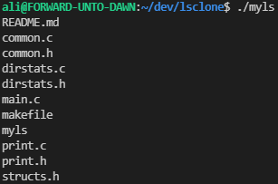
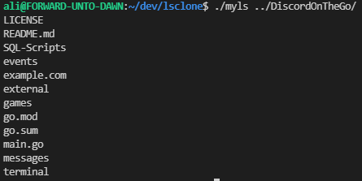
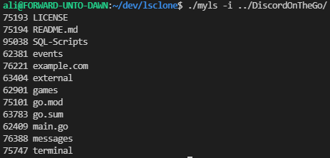
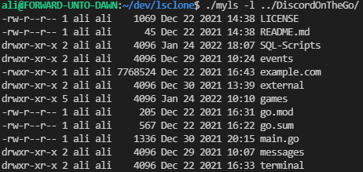
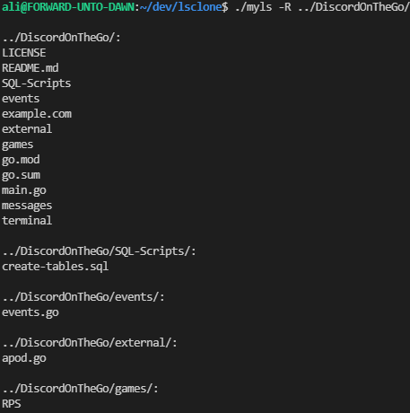
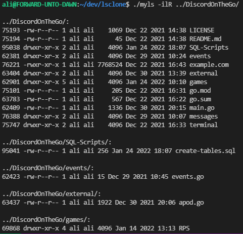

# myls
This is a project I wrote in C which mimics the 'ls' command from the UNIX file system. In this project, I learned how to use system calls to navigate the UNIX file system from a user-level program.

To run this program, simply run make in the root directory and execute myls using two optional arguments: ```./myls [options] [directory]```

# Options
Currently, the following options are supported: -i, -l, -R. These options can be run in any combination; for example ```./myls -ilR /somedir/``` and ```./myls -i -l /somedir/``` are both valid. The following screenshots use another repository 'DiscordOnTheGo' as a sample directory.

### No Options
```./myls``` will print all files and folders located in the current directory.



```./myls ../DiscordOnTheGo/``` will print all files and folders located in the specified directory.



### myls -i
The ```-i``` option prints the index number of each file alongside it.



### myls -l
The ```-l``` option prints using a long listing format.



### myls -R
The ```-R``` option recursively prints subdirectories.



### myls -ilR
An example of using all three options.


